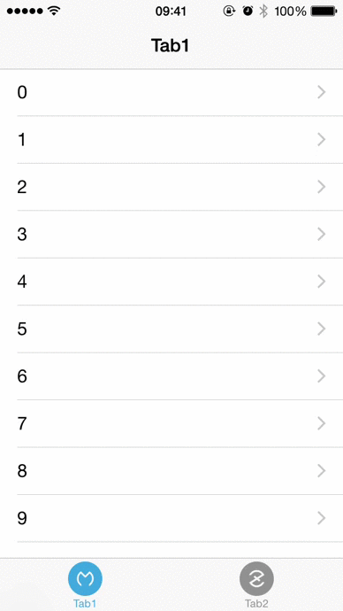

#MZNavTab
------------------
[](https://travis-ci.org/jaminzzhang/MZNavTab)

MZNavTab is an iOS library, it can help you combine UITabBar and UINavigationController.


Purpose
------------------

MZNavTab is a flexible and convenient iOS library to help you combine UITabBarController(It's UITabBar actually, or just a custom view which work like a tab bar) and UINavigationController. As an iOS developer, you may know that it's much more complex to combine UITabBarController and UINavigationController in your app, mostly we want to control the visibility of tab bar while we make a push or pop in navigation controller.




How to run examples
------------------

1. Clone the repository `git@github.com:jaminzzhang/MZNavTab.git`. Optionally you can fork the repository and clone it from your own github account, this approach would be better in case you want to contribute.
2. Open `MZNavTabSample/MZNavTabSample.xcodeproj` and run the project. Enjoy!


How to use
------------------

The simplest way to use MZNavTab is creating an instance of class `MZTabViewController` with initialization `- (instancetype)initWithTabBarItems:(NSArray *)tabBarItems itemViewControllers:(NSArray *)itemViewControllers`:


```objc
#import "MZTabViewController.h"
UITabBarItem * item1 = [[UITabBarItem alloc] initWithTitle:@"Tab1" image:[UIImage imageNamed:@"ico_tab_1"] tag:1];
UITabBarItem * item2 = [[UITabBarItem alloc] initWithTitle:@"Tab1" image:[UIImage imageNamed:@"ico_tab_2"] tag:2];

UIViewController * viewController1 = [[UIViewController alloc] init];
UIViewController * viewController2 = [[UIViewController alloc] init];
MZTabViewController * tabViewController = [[MZTabViewController alloc] initWithTabBarItems:@[item1, item2] itemViewControllers:@[viewController1, viewController2]];
```

MZNavTab is flexble, so you can use it in these ways:

1. Subclass `MZTabViewController` and build your tab bar
2. Build your tab controller instead of using `MZTabViewController` and using `MZNavTabItemController` in your tab controller (Read the code in `MZTabViewController`, you will know how to use it).


Installation
------------------
The easiest way to use MZNavTab in your app is via [CocoaPods](http://cocoapods.org/ "CocoaPods").

1. Add the following line in the project's Podfile file:
	`pod 'MZNavTab'`.
2. Run the command `pod install` from the Podfile folder directory.


Or, you can clone the repository `git@github.com:jaminzzhang/MZNavTab.git`, and copy the source files in folder `MZNavTab` to your project's folder, then drag and drop them onto your project in xcode.


  


Requirements
------------------

* ARC
* iOS 7.0 and above